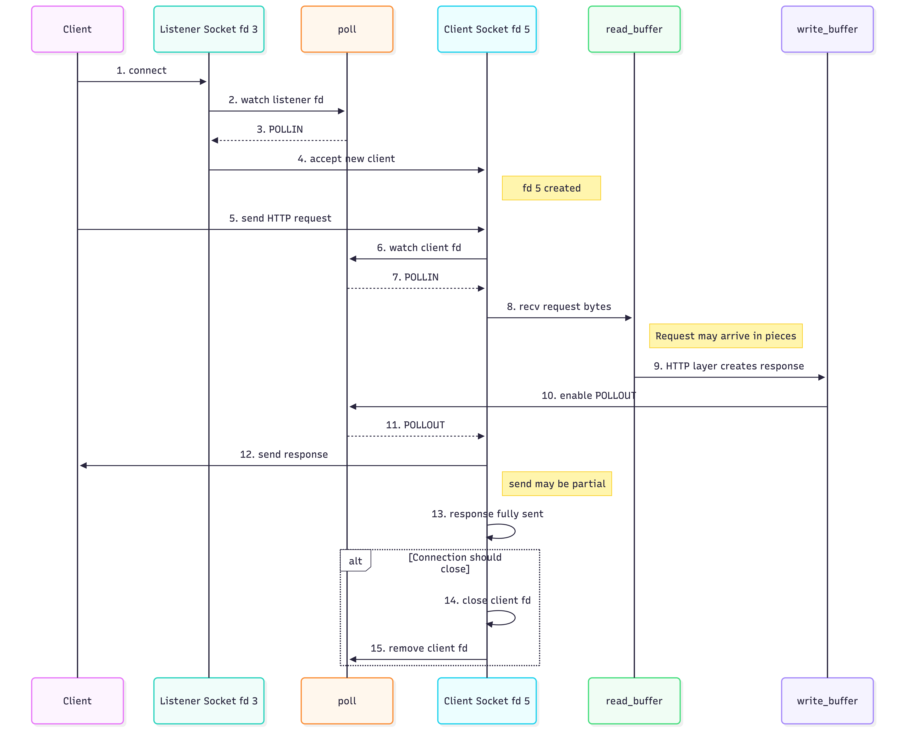

# Webserv — Server / Networking Part

The configuration parser is temporarily skipped. For development and testing, `ServerConfig` values will be hard-coded.

---
## 1. Webserv — Important Networking Terms

| Term | Meaning | Simple Example / Purpose |
|---|---|---|
| **Server** | The program that waits for clients and sends responses. | `Browser → Webserv → Browser` |
| **Host** | The IP address where the server listens. | `127.0.0.1` = this machine only. `0.0.0.0` = all available interfaces. |
| **Port** | Identifies a network service on a machine. | `127.0.0.1:8080` → port is `8080`. |
| **`Socket`** | A communication endpoint used by the program. | `fd 3 → listener`, `fd 5 → Client A`. |
| **File Descriptor (fd)** | A small integer used by the process to refer to an open socket, file, or pipe. | `3`, `5`, `6`, etc. |
| **`bind()`** | Attaches a socket to a specific host and port. | `socket fd 3 → bind → 127.0.0.1:8080` |
| **`listen()`** | Turns a bound socket into a listening socket. | The socket starts waiting for connection attempts. |
| **Client** | Something connected to the server. | Browser, `curl`, or another program. |
| **accept()** | Takes a waiting connection and creates a new client socket. | `listener fd 3 → accept() → client fd 5` |
| **Request** | Data sent from the client to the server. | `GET /index.html HTTP/1.1` |
| **Response** | Data sent from the server back to the client. | `HTTP/1.1 200 OK` |
| **Non-Blocking** | The socket never freezes the whole server while waiting for data. | If nothing is ready, return to the event loop. |
| **`poll()`** | Watches many fds and tells the server which ones are ready. Does not read or write data.| Listener ready? Client has data? Client can receive data? |
| **POLLIN** | Means an fd has something available to read. | Listener → new client waiting. Client → request data available. |
| **POLLOUT** | Means a client socket is ready for writing. | Used when there is response data waiting to be sent. |
| **recv()** | Receives raw bytes from a client socket. | `Client → recv() → read_buffer` |
| **send()** | Sends response bytes to a client socket. | `write_buffer → send() → Client` |
| **Read Buffer** | Stores incoming bytes received from a client. | A request may arrive in several pieces. |
| **Write Buffer** | Stores response bytes waiting to be sent. | `POLLOUT` is useful while this buffer is not empty. |
| **Event Loop** | The repeating loop that calls `poll()`, handles events, and checks timeouts. | `poll → handle events → timeout check → repeat` |
| **Timeout** | Disconnects clients that stay inactive for too long. | Example: disconnect after 30 seconds of inactivity. |
| **Disconnect / Cleanup** | Removes a client safely when the connection ends. | `close(fd) → remove client state → stop polling fd` |

## 2- Server flow



1. **Client connects** to the server.
2. **`poll()` watches the listener socket**.
3. Listener gets **`POLLIN`** → a new client is waiting.
4. Server calls **`accept()`** → creates a new client socket, e.g. `fd 5`.
5. Client **sends the HTTP request**.
6. `poll()` watches the client socket.
7. Client socket gets **`POLLIN`** → request data is available.
8. Server calls **`recv()`** → bytes are added to `read_buffer`.
9. HTTP layer processes the request and creates the response in `write_buffer`.
10. Because `write_buffer` has data, server enables **`POLLOUT`**.
11. `poll()` reports **`POLLOUT`** → socket is ready for writing.
12. Server calls **`send()`** → sends response to the client. It may take multiple sends.
13. When the response is fully sent, disable `POLLOUT`.
14. If the connection should close → **close client fd**.
15. Remove the client fd/state so `poll()` no longer watches it.


## 3- Tickets and code Structure


### Ticket Overview

| Ticket | Main Goal |
|---|---|
| **1** | Hard-code host and port |
| **2** | Create listening sockets |
| **3** | Make fds non-blocking |
| **4** | Accept clients |
| **5** | Run one `poll()` event loop |
| **6** | Manage `POLLIN` / `POLLOUT` |
| **7** | Dispatch events |
| **8** | Receive request bytes |
| **9** | Send response bytes |
| **10** | Clean up disconnected clients |
| **11** | Remove inactive clients |


### TICKET #1 — Hard-Coded Configuration

#### What it does
Creates the minimum `ServerConfig` values manually, such as:

```text
host = 127.0.0.1
port = 8080
```

These values are passed directly to the Server.

#### Why it is needed
The Server needs a host and port before it can create listening sockets.

This lets us build and test networking before the config parser is ready.

---

### TICKET #2 — Create and bind listening sockets

#### What it does
Creates one listening socket for each unique `host:port`.

Main flow:

```text
socket
↓
SO_REUSEADDR
↓
bind
↓
listen
```

#### Why it is needed
This creates the entry point where clients can connect to Webserv.

---

### TICKET #3 — Set all file descriptors to non-blocking mode

#### What it does
Makes listening sockets and accepted client sockets non-blocking.

#### Why it is needed
One slow client must never freeze the whole server.

The server should always return to the event loop instead of waiting on one fd.

---

### TICKET #4 — Accept new client connections

#### What it does
When a listening socket is ready, `accept()` creates a new client socket.

The new client gets its own state:

```text
fd
read buffer
write buffer
last activity
```

#### Why it is needed
The listening socket only waits for connections.

A separate client socket is required to communicate with each connected client.


---

### TICKET #5 — Implement the single poll() event loop

#### What it does
Creates the main loop that watches all active fds using one `poll()`.

```text
poll
↓
handle ready fds
↓
check timeouts
↓
repeat
```

#### Why it is needed
The server must manage many clients without blocking and without one thread per client.


---

### TICKET #6 — Monitor read and write readiness per fd

#### What it does
Controls whether each client is watched for:

```text
POLLIN  → ready to read
POLLOUT → ready to write
```

`POLLOUT` is enabled only when response data is waiting.

#### Why it is needed
Watching `POLLOUT` all the time can cause a busy loop and waste CPU.

---

### TICKET #7 — Dispatch poll() events to handlers

#### What it does
Takes the events returned by `poll()` and sends them to the correct handler.

```text
Listener + POLLIN → accept
Client + POLLIN   → read
Client + POLLOUT  → write
Error / hangup    → disconnect
```

#### Why it is needed
It keeps the event loop simple and separates networking actions into clear handlers.


---

### TICKET #8 — Read raw request data from client fd

#### What it does
Uses `recv()` after `POLLIN` and appends received bytes to the client's `read_buffer`.

It also updates `last_active`.

#### Why it is needed
HTTP requests may arrive in several pieces, so bytes must be accumulated before parsing.

---

### TICKET #9 — Write response data to client fd

#### What it does
Uses `send()` after `POLLOUT` to send data from the client's `write_buffer`.

Tracks how much has already been sent.

#### Why it is needed
`send()` may send only part of a response, so the remaining bytes must be sent later.


---

### TICKET #10 — Handle client disconnection cleanly

#### What it does
Uses one cleanup path for every client disconnect.

```text
close fd
↓
remove client state
↓
stop polling fd
```

#### Why it is needed
Leaking sockets or client objects will eventually exhaust system resources.


---

### TICKET #11 — Request timeout enforcement

#### What it does
Tracks the last activity time for every client and removes clients that stay inactive too long.

#### Why it is needed
A client must not be allowed to connect and hold resources forever without completing a request.

---
